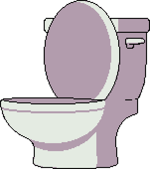

# Dont_Pee_Yourself



Don't Pee Yourself is a text-based game in which you have to try not to pee yourself.

You must enter commands to help [NAME NOT DECIDED] not to pee themselves (ideally they'd get to the toilet, image above if you don't know what a toilet is).

If you're not sure where you are or what to do, feel free to `look around`.

But be warned: you may get frustrated and want to `stab` your `computer`, but that may realease something you don't want...

Also, if you type `no u`, your cpu may have some trouble.

# HOW TO RUN
This game requires Python 3.

```shell
python3 main.py
```

There is a Pipfile included for use with pipenv, this is the best way to run the pytests.

```shell
pipenv shell
pytest
```